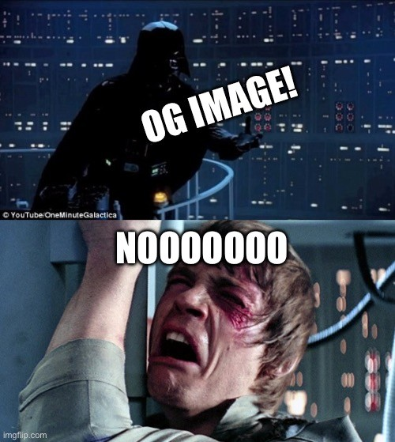

What great irony: a rage-post on OG images when one of my earliest contributions to Elk was the [first implementation of preview cards](https://github.com/elk-zone/elk/pull/339). When we got that in, the timeline really came to life. In my humble opinion. Like all my opinions. 

But the more I see how people use the OG (originally great) image, I realize how hard it is to work with visually in a design. And the cognitive load it adds for me as a reader doesn’t help too… I don’t want the emotional click-bait tactics. 

So when I worked on my own site’s [**/threads**](https://ayo.ayco.io/threads) page recently, I tried to skip showing the image--though more out of laziness than intentional. I decided to just show the more important information people should know before clicking a link: source, full title, and full description… yup none of them cut down. Hopefully no one writes an essay in their meta tags though. 

…And then I realized how calm and *how much* controlled the layout is. *How Much* I Love the feeling that no one out there can ruin the feels on my personal `/threads` page. 

“But you don’t understand, Ayo, it’s an art. What about all the dynamic script I wrote, Ayo?”

Okay let’s have an honest conversation about that. 

You already wrote a lot of words on your blog. And you wanna use an image to… display more words?

Why not be abstract for a change and show a picture of something that may help invoke the feelings that reinforces the message you want to convey in your post? Like Darth Vader and Luke sharing a nice moment about OG images?

**Okay,** I get it, it’s magical. Dynamic image. Automated stuff. So why don’t we get to some healthy compromise here.

If you reaaaaaaally have to do it, here are some nice points to consider (yay blog post with a list!)
1. Imagine a square at the center, and try to put stuff as close to it as you can. You’ll thank yourself when you see your post shared somewhere with small preview cards. 
2. Dark theme? Yeah. When your image shows up in an app, it doesn’t respect the user’s preferences. No one will click on that link if you blind their eyes before they can read the description. Believe me.
3. No portrait aspect ratio 🥲 (I try to limit my emojis but this one’s worth it). If you think no one does this, you might as well believe Earth is flat. I’ve seen a lot. I want to think they were on the lazy side and just used whatever image they found, but… no matter the reason. Just don’t 

I kind of wish we have a standard on how browsers process OG images. Like some auto invert color mechanism to sync with the user’s preferences. I don’t know. For now I will just not show them. 

Visit my [/threads](https://ayo.ayco.io/threads) page!

