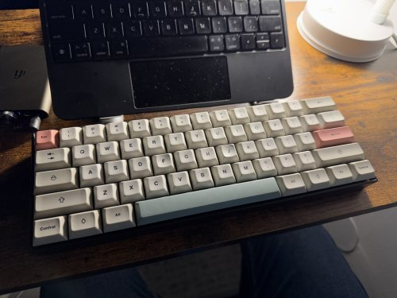
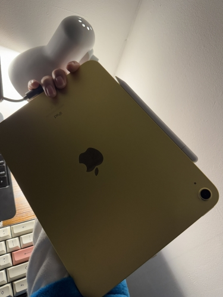
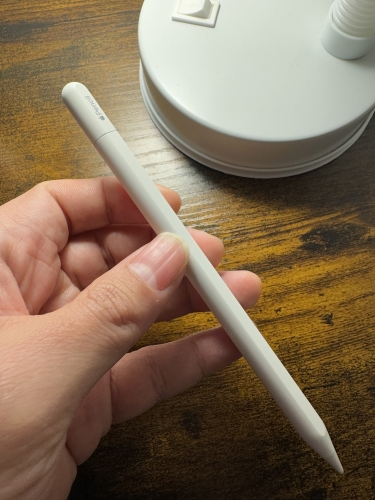
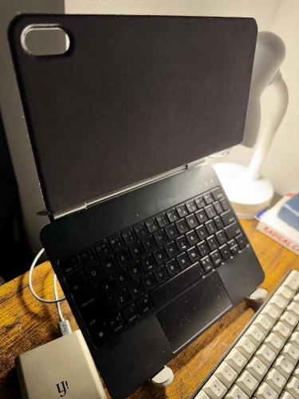

This is the first of a hundred-part series to cover all my setups for all the things I do and/or want to do. For now, I want to start with my setup for writing this...

## The Setup

I have an iPad-powered writing setup in a small corner in my apartment. I use a mechanical keyboard; they call this 60% because... I guess because it’s small? It doesn’t have a numpad, or arrow keys... oh no, I think this is the 45 % because 60% has arrow keys. So yeah, I like this... I had a phase when I really liked obsessing on mechanical keybs, but now I mostly feel like I’m actually just a poser, because I don’t have a lot of ‘em. I only have this one and another one--which is.... I think it’s a 60%? It’s a weirder one but that’s for another blog I guess.

> The brand is Redragon but I don't remember the model. I changed the keycaps to a different profile (shorter) and classic look.

Moving on to my DAC in this setup... But first, what is a DAC? Well, I’m glad you asked. It’s an acronym. More importantly, it stands for Digital-to-Analog-Converter... I think. The ‘C’ part, I have to check again if it’s the right word, but I’m pretty sure the D-A part is Digital and Analog. It converts the digital bit from the computer (i.e., the iPad) into electrical bit that will travel through the wire into your headphones. It is important to note that most computers have an internal DAC (also called “sound card”) but they suck. So I have this one, and it is portable compared to my other one which is not but that’s for another blog. Told you it’s a hundred-part series.

> iFi Audio Hip-DAC3

For the iPad itself I have a 2018 model USB-C that is color Yellow. Let’s break down the technical reasons for each of those adjectives.

1. 2018 model - why? Because I’m cheap. And it’s the first time I bought an iPad. I actually regret this a tiny bit because sometimes it is slow for some things, but I just learned to not rely on it on heavy things. I forgive it. Maybe I should not be so hard on it, or myself for getting it.
2. USB-C - this is the best thing about the thing. It used to be that iPads needed a lightning cable. No more. It’s time to be reasonable, thought Apple. Why? Because of this we can use a lot with the thing without converters, including DACs. Which is a converter (I just checked)
3. Color Yellow - why? Because everyone gets black or gray. If my iPad gets lost and I have to ask lost and found, there’s a 87.02% chance mine is the only yellow one. Or some kid’s. I thought I’d probably get a case and it wouldn’t matter much. And if you squint your eyes you can pretend it’s gold and that’s a fancy color.

> 10.9-inch iPad Wi‑Fi 64GB - Yellow

I also have an Apple Pencil which my kid uses sometimes. I also used it recently because I subscribed to Canva free trial to [create](https://social.ayco.io/@ayo/113776535074404987) [logos](https://fosstodon.org/@ayo/113798128716540561). :) [Hire me to make your next branding library](mailto:ayo@ayco.io)

> Apple Pencil (USB-C)

That’s it, thanks for reading the first of my hundred-part series to cover all my setups. Next time let’s talk about my setup for stopping writing.

Oh yeah, the iPad is on a magnetic case that has a keyboard. The keyboard works but I don’t like it, if I’m honest. It's used when on-the-go, mostly.

> Wireless keyboard case from Temu

Oh man, I'm not sure if I like this post
